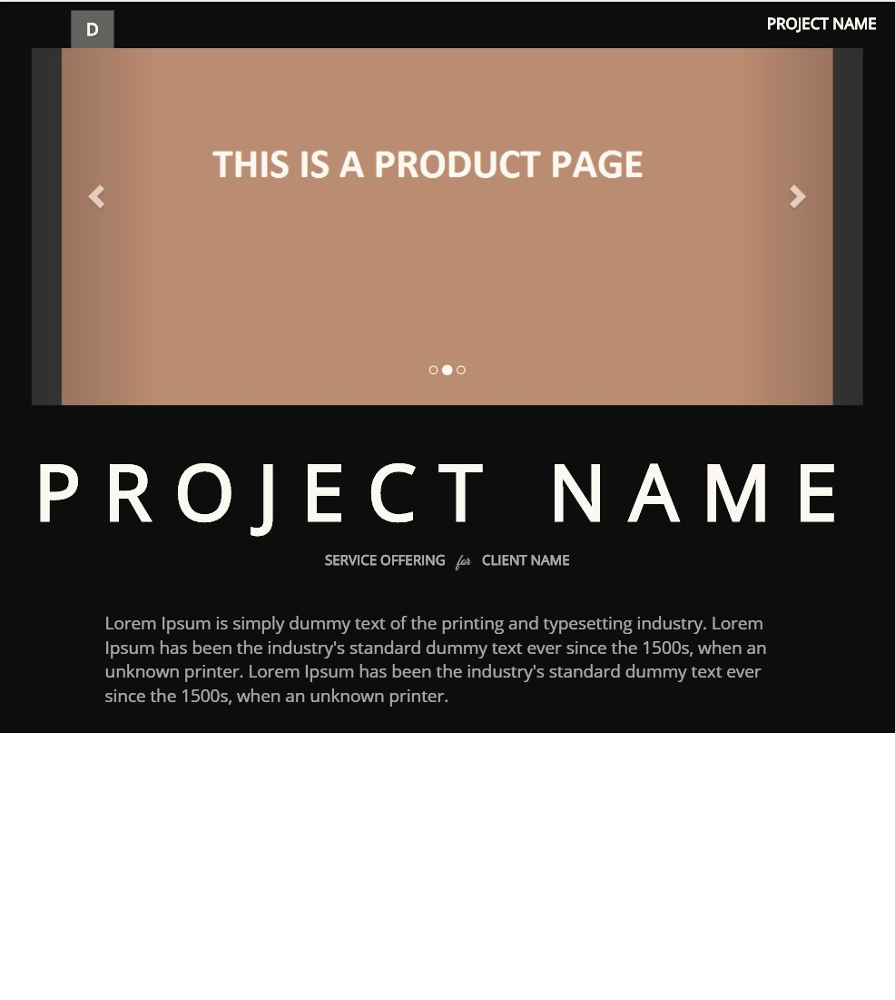

# React Layout using react-bootstrap and styled components

## To Run

    npm install
    npm start
    Open http://localhost:3005
    
## Test
```json
{
  "listen": ":8124", 
  "flush_count": 10000, // check by \n char
  "flush_interval": 1000, // milliseconds
  "debug": false, // log incoming requests
  "dump_dir": "dumps", // directory for dump unsended data (if clickhouse errors)
  "clickhouse": {
    "down_timeout": 300, // wait if server in down (seconds)
    "servers": [
      "http://127.0.0.1:8123"
    ]
  }
}
```

## Screenshot


